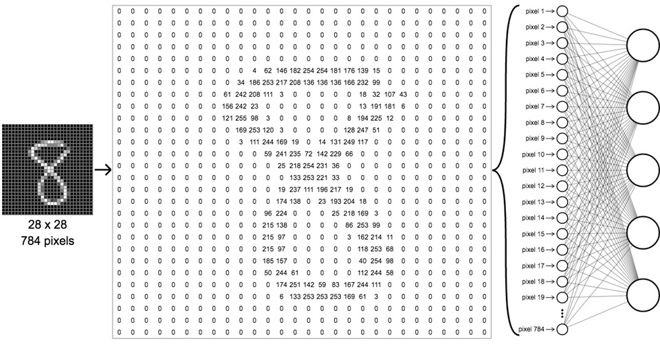

# NeuralNetwork with Python
> run neuralnetwork to train mnist 

[![python-image]][python-url]




## What is this?

신경망을 직접 구현하고, mnist 데이터셋을 학습시킵니다.

+ NeuralNetwork with Python : https://github.com/hhkwon/NeuralNetwork


## Language

> `Python 3.6`


## DataSet

+ Raw Data
    + mnist_test.csv ( _mnist test set_ )
    + mnist_train.csv ( _mnist train set_ )

<!-- 2. Polished Data
    + MASTER
    + NAVER_IDST
    + KRX_DATA_ALL
    + KRX_DATA_BIO
    + KRX_DATA_BIO_bycode -->


## Process

1. Sourcing Raw Data

2. Pre-processing
    + inputs = (np.asfarray(all_values[1:]) / 255.0 * 0.99) + 0.01
3. Modeling (Update Weight)
    + inputs = np.array(inputs_list, ndmin=2).T
    + targets = np.array(targets_list, ndmin=2).T
    + (hidden_inputs, hidden_outputs), (final_inputs, final_outputs)
    + output_errors = targets - final_outputs, 
    + hidden_errors = np.dot(self.who.T, output_errors)
    + self.who += `self.learning_rate` * np.dot((`output_errors` * `final_outputs` * `(1.0 - final_outputs)`),
                                                `np.transpose(hidden_outputs)`)
    + self.wih += `self.learning_rate` * np.dot((`hidden_errors` * `hidden_outputs` * `(1.0 - hidden_outputs)`),
                                                `np.transpose(inputs)`)
4. Output Sharing
    + correct_label = int(`all_values[0]`)
    + label = np.argmax(`outputs`)
    + scorecard_array = np.asarray(`scorecard`)
    + print("performance = ", `scorecard_array.sum()` / `scorecard_array.size`)


## Library

```python
`PYTHON`
import numpy as np
import matplotlib.pyplot as plt
import scipy.special
```


## Release History

* 0.0.1
    * First Commit (2019/02/02)


<!-- Markdown link & img dfn's -->
[r-image]: https://img.shields.io/badge/R-3.5.0-brightgreen.svg?style=flat-square
[r-url]: https://cran.r-project.org/bin/windows/base/
[python-image]: https://img.shields.io/badge/python-3.6-yellow.svg?style=flat-square
[python-url]: https://www.python.org/
[aws-image]: https://img.shields.io/badge/aws-pass-orange.svg?style=flat-square
[aws-url]: https://aws.amazon.com/
